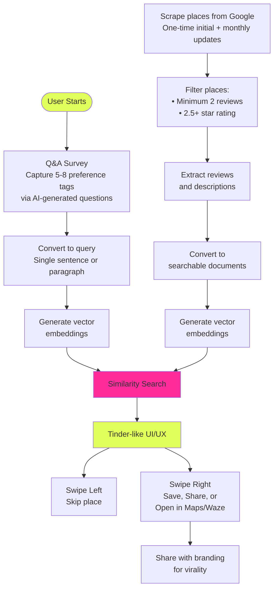

# spot

**find places that match your vibe**

spot is a mobile app that helps you discover places (restaurants, cafes, venues, etc.) that align with your preferences through an AI-powered matching system and an intuitive Tinder-like interface.

## Overview

spot uses vector embeddings and similarity search to match your preferences with places based on their reviews and descriptions. The app presents results in a swipeable card interface, making it easy to discover and save places you'll love.

## System Architecture



## How It Works

### 1. User Input & Query Generation

- **Q&A Survey**: Answer AI-generated questions to capture 5-8 preference tags
- **Query Conversion**: Transform your answers into a single sentence or paragraph
- **Vectorization**: Convert the query into embeddings for semantic search

### 2. Place Data Ingestion

- **Data Collection**: Scrape places from Google Maps (one-time initial scrape + monthly updates)
  - Minimum 2 reviews required
  - 2.5+ star rating threshold
- **Content Extraction**: Gather reviews and "about" information for each place
- **Document Processing**: Convert place information into searchable documents
- **Vectorization**: Generate embeddings for each place

### 3. Matching & Results

- **Similarity Search**: Match your query embeddings with place embeddings
- **Tinder-like UI**: Browse results through an intuitive swipe interface
  - **Swipe left**: Skip a place
  - **Swipe right**: Save or share a place
  - **Open in Maps**: Launch in Google Maps or Waze for directions
- **Sharing**: Share places with built-in branding for virality

## Tech Stack

- **Framework**: Expo (React Native)
- **AI/ML**: OpenAI for embeddings and query generation
- **Vector Search**: Similarity matching for place recommendations
- **UI**: Custom swipe interface with native gestures

## Getting Started

### Prerequisites

- Node.js (v18 or later)
- npm or bun
- Expo CLI

### Installation

1. Install dependencies:

   ```bash
   npm install
   ```

2. Start the development server:

   ```bash
   npx expo start
   ```

3. Open the app on your device:
   - Scan the QR code with Expo Go (iOS/Android)
   - Press `i` for iOS simulator
   - Press `a` for Android emulator
   - Press `w` for web browser

## Project Structure

```
spot/
├── app/              # Expo Router screens
├── components/       # Reusable UI components
│   ├── common/      # Shared components
│   └── survey/      # Survey-specific components
├── contexts/        # React contexts (Survey, Fonts)
├── data/            # Survey questions and data
├── services/        # API services (OpenAI)
├── constants/       # Theme and dimension constants
└── hooks/           # Custom React hooks
```

## Development

This project uses [Expo Router](https://docs.expo.dev/router/introduction/) for file-based routing. Edit files in the `app` directory to modify screens and navigation.

## Learn More

- [Expo documentation](https://docs.expo.dev/)
- [Expo Router documentation](https://docs.expo.dev/router/introduction/)
- [React Native documentation](https://reactnative.dev/)
