# spot

**find places that match your vibe**

spot is a mobile app that helps you discover places (restaurants, cafes, venues, etc.) that align with your preferences through an AI-powered matching system and an intuitive Tinder-like interface.

## Overview

spot uses vector embeddings and similarity search to match your preferences with places based on their reviews and descriptions. The app presents results in a swipeable card interface, making it easy to discover and save places you'll love.

## System Architecture

```mermaid
flowchart TD
    Start([User Starts]) --> Q&A[Q&A Survey<br/>Capture 5-8 preference tags<br/>via AI-generated questions]

    Q&A --> ConvertQuery[Convert to query<br/>Single sentence or paragraph]
    ConvertQuery --> UserVectors[Generate vector<br/>embeddings]

    Scrape[Scrape places from Google<br/>One-time initial + monthly updates] --> Filter[Filter places:<br/>• Minimum 10 reviews<br/>• 3.8+ star rating]
    Filter --> GetReviews[Extract reviews<br/>and descriptions]
    GetReviews --> ConvertDocs[Convert to<br/>searchable documents]
    ConvertDocs --> PlaceVectors[Generate vector<br/>embeddings]

    UserVectors --> Similarity[Similarity Search]
    PlaceVectors --> Similarity

    Similarity --> UI[Tinder-like UI/UX]
    UI --> SwipeLeft[Swipe Left<br/>Skip place]
    UI --> SwipeRight[Swipe Right<br/>Save, Share, or<br/>Open in Maps/Waze]
    SwipeRight --> Share[Share with branding<br/>for virality]

    style Start fill:#e1ff5b,color:#1e1e1e
    style Similarity fill:#ff2d9b,color:#f8f8f8
    style UI fill:#e1ff5b,color:#1e1e1e
```



## How It Works

### 1. User Input & Query Generation

- **AI Survey**: Answer 6-10 dynamically generated questions using Gemini AI
  - Questions adapt based on previous answers
  - Gen-Z tone with emoji feedback
  - Captures preferences for cuisine, ambiance, group size, and special requests
- **Query Generation**: Transform answers into a natural 2-4 sentence place description
- **Vectorization**: Convert the query into embeddings using Gemini's `text-embedding-004` model

### 2. Place Data & Matching

- **Data Source**: Places stored in Supabase with vector embeddings
- **Similarity Search**: Match query embeddings with place embeddings using pgvector
- **Filtering**: Optional filters for distance, open now status, and city

### 3. User Experience

- **Suggestions Screen**: Browse results through an intuitive swipe interface
  - **Swipe left**: Skip a place
  - **Swipe right**: Save to My Spots
  - **Tap**: View place details, photos, and reviews
  - **Filters**: Distance and "Open Now" filters
- **My Spots**: View and manage all saved places
  - Search functionality
  - Share multiple spots via unique code
  - Open in Maps/Waze for directions
  - Remove spots
- **Recommendations**: Share and discover places via shareable codes (`linkto.spot/recos/CODE`)
- **Location Services**: Optional location-based filtering and distance calculations

## Tech Stack

- **Framework**: Expo (React Native) with New Architecture enabled
- **Routing**: Expo Router (file-based routing)
- **Styling**: NativeWind (Tailwind CSS for React Native)
- **Backend/Database**: Supabase (PostgreSQL with pgvector)
- **AI/ML**: Google Gemini AI
  - `gemini-2.5-flash` for question and query generation
  - `text-embedding-004` for vector embeddings
- **Places API**: Google Places API (New) for place data and photos
- **State Management**: React Context API
- **Animations**: React Native Reanimated, Gesture Handler
- **Storage**: AsyncStorage for local data persistence

## Features

- 🤖 **AI-Powered Survey**: Dynamic question generation based on user responses
- 🎯 **Semantic Search**: Vector similarity matching for accurate place recommendations
- 💫 **Swipeable Interface**: Tinder-like card interface for browsing places
- 📍 **Location Services**: Location-based filtering and distance calculations
- 🔍 **Filters**: Distance and "Open Now" filtering options
- 💾 **My Spots**: Save and manage favorite places
- 🔗 **Sharing**: Share places via unique codes with deep linking
- 🗺️ **Maps Integration**: Open places in Google Maps or Waze
- 📸 **Photo Carousel**: Browse place photos from Google Places API
- 🎨 **Modern UI**: Custom animations, haptic feedback, and glass effects

## Getting Started

### Prerequisites

- Node.js (v18 or later)
- npm, yarn, or bun
- Expo CLI
- iOS Simulator (for iOS development) or Android Emulator (for Android development)

### Installation

1. Clone the repository:

   ```bash
   git clone <repository-url>
   cd spot
   ```

2. Install dependencies:

   ```bash
   npm install
   # or
   bun install
   ```

3. Set up environment variables:

   Create a `.env` file in the root directory with:

   ```env
   EXPO_PUBLIC_GEMINI_API_KEY=your_gemini_api_key
   EXPO_PUBLIC_GOOGLE_PLACES_API_KEY=your_google_places_api_key
   EXPO_PUBLIC_SUPABASE_URL=your_supabase_url
   EXPO_PUBLIC_SUPABASE_ANON_KEY=your_supabase_anon_key
   ```

4. Start the development server:

   ```bash
   npm start
   # or
   bun start
   ```

5. Open the app:
   - Scan the QR code with Expo Go (iOS/Android)
   - Press `i` for iOS simulator
   - Press `a` for Android emulator
   - Press `w` for web browser

### Building

- **Android**: `npm run build:android` or `npm run deploy:android`
- **iOS**: `npm run build:ios` or `npm run deploy:ios`

## Project Structure

```
spot/
├── app/                    # Expo Router screens
│   ├── index.tsx          # Entry point (Survey)
│   ├── survey.tsx         # Survey screen
│   ├── suggestions.tsx    # Suggestions/swipe screen
│   ├── my-spots.tsx       # Saved spots screen
│   ├── recommendations/   # Shared recommendations
│   └── recos/            # Deep link handler
├── components/            # Reusable UI components
│   ├── common/           # Shared components
│   ├── survey/           # Survey-specific components
│   ├── suggestions/      # Suggestion card components
│   └── my-spots/         # My Spots components
├── contexts/             # React contexts
│   ├── survey-context.tsx
│   ├── suggestions-context.tsx
│   ├── my-spots-context.tsx
│   ├── location-context.tsx
│   └── ...
├── services/             # API services
│   ├── gemini.ts         # Gemini AI integration
│   ├── places.ts         # Google Places API
│   ├── supabase.ts       # Supabase client & functions
│   └── storage.ts        # Local storage utilities
├── data/                 # Type definitions and data
├── constants/           # App constants (theme, routes, etc.)
├── hooks/                # Custom React hooks
└── utils/               # Utility functions
```

## Development

This project uses [Expo Router](https://docs.expo.dev/router/introduction/) for file-based routing. Edit files in the `app` directory to modify screens and navigation.

### Key Technologies

- **Expo Router**: File-based routing with typed routes
- **NativeWind**: Tailwind CSS for React Native
- **React Native Reanimated**: Smooth animations and gestures
- **Supabase**: Backend-as-a-Service with PostgreSQL and pgvector
- **Google Gemini AI**: AI-powered question generation and embeddings

## Learn More

- [Expo documentation](https://docs.expo.dev/)
- [Expo Router documentation](https://docs.expo.dev/router/introduction/)
- [React Native documentation](https://reactnative.dev/)
- [Supabase documentation](https://supabase.com/docs)
- [Google Gemini AI documentation](https://ai.google.dev/docs)
- [NativeWind documentation](https://www.nativewind.dev/)
